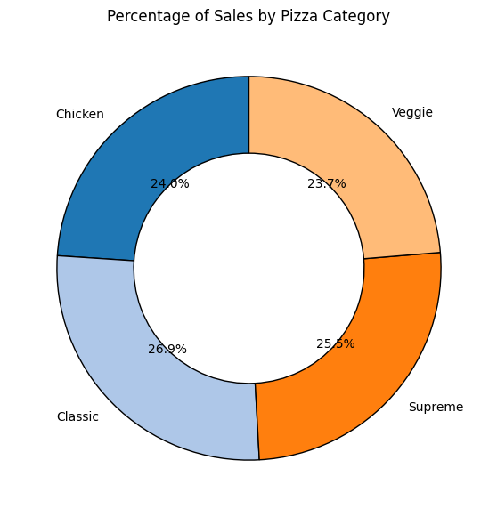
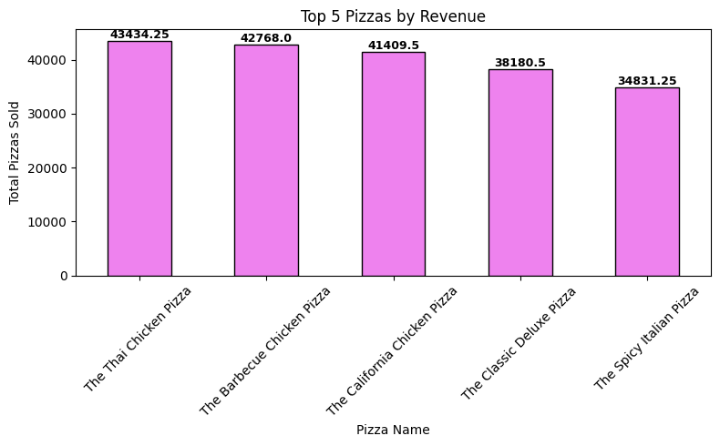

# pizza-sales-analysis-python
Business Performance Analysis of Pizza Sales using Python
# 🍕 Pizza Sales Performance Analysis using Python

> **An end-to-end Exploratory Data Analysis (EDA) project that transforms raw pizza sales transactions into actionable business insights using Python.**

---

# 📖 Table of Contents

- Project Overview
- Business Problem
- Dataset
- Technology Stack
- Methodology
- Key Performance Indicators
- Visualizations
- Business Insights
- Business Recommendations
- How to Reproduce
- Project Structure
- Future Enhancements
- Author

---

# 📌 Project Overview

This project analyzes one full year of pizza sales transactions to understand customer purchasing behavior, sales performance, and operational trends.

Using Python, the project transforms raw transactional data into meaningful Key Performance Indicators (KPIs), visual reports, and business recommendations that can help restaurant managers improve revenue, optimize staffing, and make informed business decisions.

The entire project was developed using **Google Colab** and is fully compatible with **Jupyter Notebook**.

---

# 🎯 Business Problem

Restaurant managers often collect thousands of sales transactions but struggle to answer important business questions such as:

- Which pizzas generate the highest revenue?
- Which products sell the most?
- Which days and hours receive the highest customer demand?
- Which pizza categories contribute the most revenue?
- Which products should be promoted or removed from the menu?
- Which ingredients are used most frequently for inventory planning?

This project converts raw sales data into actionable business intelligence.

---

# 📂 Dataset

| Detail | Information |
|---------|-------------|
| Dataset Type | Pizza Sales Transactions |
| Records | 48,620 Line Items |
| Time Period | January 1 – December 31, 2015 |
| Data Granularity | One row represents one pizza sold within an order |

### Dataset Columns

- Pizza ID
- Order ID
- Pizza Name
- Pizza Category
- Pizza Size
- Quantity
- Unit Price
- Total Price
- Order Date
- Order Time
- Pizza Ingredients

---

# 🛠 Technology Stack

| Tool | Purpose |
|------|----------|
| Python | Data Analysis |
| Google Colab | Development Environment |
| Pandas | Data Cleaning & Analysis |
| NumPy | Numerical Operations |
| Matplotlib | Data Visualization |
| Seaborn | Statistical Visualization |
| Plotly | Interactive Charts |
| OpenPyXL | Excel File Handling |
| GitHub | Version Control |

---

# 🔍 Methodology

The project follows a structured data analysis workflow:

### 1. Data Import

- Loaded the Excel dataset into Python using Pandas.

### 2. Data Inspection

- Examined dataset structure.
- Checked data types.
- Generated summary statistics.

### 3. Data Quality Assessment

- Verified missing values.
- Checked duplicate records.
- Validated data consistency.

### 4. KPI Calculation

Calculated the following business metrics:

- Total Revenue
- Total Orders
- Total Pizzas Sold
- Average Order Value
- Average Pizzas per Order

### 5. Exploratory Data Analysis

Analyzed:

- Daily Sales Trends
- Hourly Sales Trends
- Monthly Sales Trends
- Pizza Category Performance
- Pizza Size Distribution
- Ingredient Frequency
- Top Performing Products
- Bottom Performing Products

### 6. Visualization

Created business-focused charts to support decision-making.

---

# 📊 Key Performance Indicators

| KPI | Value |
|------|--------|
| 💰 Total Revenue | **$817,860.05** |
| 🍕 Total Pizzas Sold | **49,574** |
| 🛒 Total Orders | **21,350** |
| 💵 Average Order Value | **$38.31** |
| 📦 Average Pizzas per Order | **2.32** |

---

# 📈 Visualizations

The project includes the following visualizations:

- Total Orders by Day of Week
- Total Revenue by Day of Week
- Orders by Hour
- Monthly Sales Trend
- Percentage of Sales by Pizza Category
- Sales by Pizza Size & Category (Heatmap)
- Total Pizzas Sold by Pizza Category
- Top 5 Best-Selling Pizzas by Quantity
- Bottom 5 Pizzas by Quantity
- Top 5 Pizzas by Revenue
- Bottom 5 Pizzas by Revenue

### Sample Visualizations

## Total Revenue by Day


## Sales by Pizza Category



---

## Top 5 Pizzas by Revenue



---

**Additional visualizations are available in the `Images` folder and within the project notebook.**

---

# 💡 Business Insights

### 📌 Customer Demand

Customer orders gradually increase throughout the week and reach their highest level on **Friday**, indicating strong demand before the weekend.

### 📌 Peak Ordering Hours

Most customer orders occur during lunch and evening hours, helping managers optimize staffing schedules.

### 📌 Revenue Distribution

A small number of pizza varieties contribute a significant portion of total revenue, highlighting the importance of maintaining stock for high-performing products.

### 📌 Product Performance

Top-selling pizzas consistently outperform others in both revenue and quantity sold, while a few pizzas contribute very little to overall sales.

### 📌 Category Performance

Classic pizzas account for the highest proportion of total sales, making them a key revenue driver.

### 📌 Inventory Planning

Frequently used ingredients such as Garlic, Tomatoes, Mozzarella Cheese, Red Onions, and Red Peppers should receive priority during inventory planning to reduce stock shortages.

---

# 🚀 Business Recommendations

- Promote best-selling pizzas through marketing campaigns.
- Bundle low-performing pizzas with popular products.
- Increase staffing during peak business hours.
- Optimize ingredient inventory based on demand patterns.
- Review pricing strategies for low-performing products.
- Introduce seasonal promotions during slower sales periods.

---

# ▶️ How to Reproduce this Project

### Clone the Repository

```bash
git clone https://github.com/Gladiya-15-Analyst/pizza-sales-analysis-python.git
```

### Install Required Libraries

```bash
pip install -r requirements.txt
```

### Open the Notebook

Launch the notebook using **Google Colab** or **Jupyter Notebook** and run all cells.

---

# 📄 requirements.txt

```
pandas
numpy
matplotlib
seaborn
plotly
openpyxl
```

---

# 📁 Project Structure

```
pizza-sales-analysis-python
│
├── Data
│   ├── pizza_sales_excel_file.xlsx
│   └── README.md
│
├── Images
│   ├── total_orders_day.png
│   ├── revenue_by_day.png
│   ├── orders_by_hour.png
│   ├── monthly_trend.png
│   ├── sales_category.png
│   ├── heatmap.png
│   ├── top5_qty.png
│   ├── bottom5_qty.png
│   ├── top5_revenue.png
│   ├── bottom5_revenue.png
│   └── README.md
│
├── Notebook
│   ├── Pizza_Data_Python_Analysis.ipynb
│   └── README.md
│
├── requirements.txt
└── README.md
```

---

# 🔮 Future Enhancements

- Develop an interactive Power BI dashboard.
- Integrate SQL for advanced querying.
- Build sales forecasting models using machine learning.
- Create customer segmentation analysis.
- Develop an interactive Streamlit dashboard.
- Automate report generation for business stakeholders.

---

# 👩‍💻 Author

## Gladiya Francline

**Aspiring Data Analyst**

### Skills

- Python
- SQL
- Excel
- Power BI
- Pandas
- NumPy
- Matplotlib
- Seaborn

---

⭐ **If you found this project useful, consider giving this repository a star!**

Thank you for taking the time to explore this project. Feedback and suggestions are always welcome.
